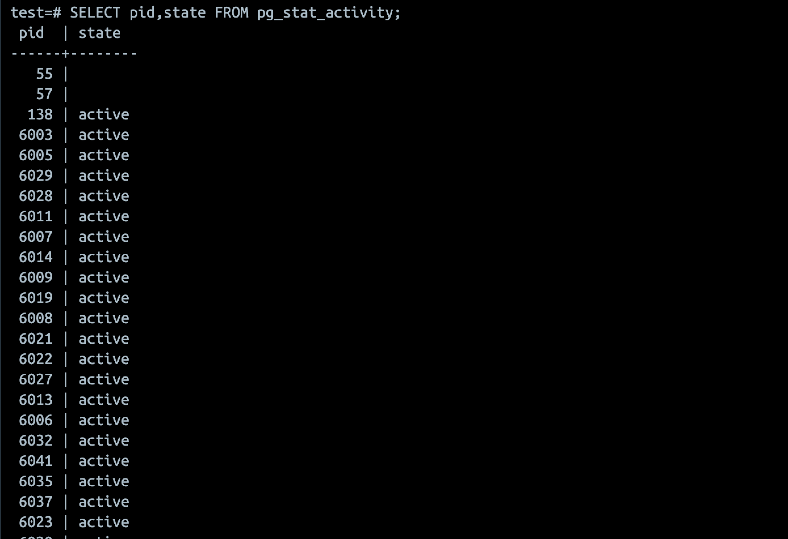

# 개요
* postgresl 커넥션 테스트

# postgres 생성

```bash
make up
```

# postgres 삭제

```bash
make down
```

# loadtest

* 파이썬 가상환경 활성화

```bash
python -m venv venv
source ./venv/bin/activate

pip install -r requirements.txt
```

* 동시 접속 테스트 방법

```bash
# select 1쿼리를 동시 실행
python simple.py -n {동시 접속 개수}

# bash sleep 10초를 동시 실행
python sleep.py -n {동시 접속 개수}
```

# 테스트 결과

* max_connection 100개 일 떄, 동시 접속 100번하면 에러 발생


* sleep을 실행하면 activate session발생


